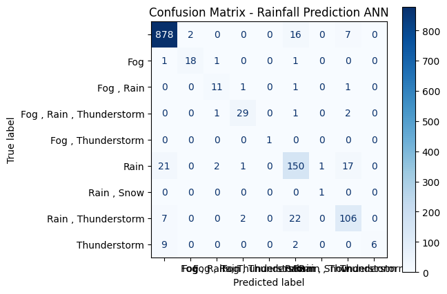

# 🌧️ Rainfall Prediction using **Artificial Neural Networks (ANN)**

A deep learning project that predicts rainfall events based on historical Austin weather data using **Keras**, **TensorFlow**, and **Artificial Neural Networks (ANN)**.  
This project demonstrates how **ANNs** can model complex non-linear relationships in climate data to predict weather conditions with high accuracy.

---

## 🧠 Project Overview

This project leverages a **multi-layer Artificial Neural Network (ANN)** to classify rainfall events such as *No Rain*, *Rain*, *Thunderstorm*, and *Fog*.

The **Austin Weather Dataset (Kaggle)** was used, containing 1,300+ daily records and 20+ meteorological features (temperature, humidity, dew point, visibility, etc.).

**Goal:** Build a reliable **ANN model** that learns complex weather patterns and predicts rainfall outcomes effectively.

---

## ⚙️ Workflow

### 🧹 1. Data Preprocessing
- Cleaned missing and invalid entries
- Scaled numerical columns for optimal ANN convergence
- Encoded categorical weather event labels

### 🧩 2. Model Training (ANN)
- **Architecture:** 3 Dense layers (`ReLU` + `Softmax`)
- **Optimizer:** Adam
- **Loss:** Sparse Categorical Crossentropy
- **Epochs:** 1000
- Trained using `TensorFlow` + `Keras` sequential API

### 🔎 3. Model Evaluation
- Calculated **Accuracy**, **Precision**, **Recall**, **F1-score**
- Visualized results using **Confusion Matrix**

### 📊 4. Visualization
- Training Accuracy & Loss curves
- Confusion Matrix plot under `visuals/`

---

## 💡 Why ANN?

> Traditional models like Decision Trees and Naïve Bayes struggle with non-linear weather patterns.  
> **Artificial Neural Networks (ANNs)** excel because they:
> - Learn complex relationships among weather parameters  
> - Self-adjust weights via **backpropagation**  
> - Handle both continuous and categorical inputs  
> - Achieve superior predictive accuracy on real-world climate data  

---

## 🧩 Tech Stack

- 🐍 **Python 3.10**
- 🧠 **TensorFlow / Keras (ANN architecture)**
- 📊 **scikit-learn**
- 📈 **NumPy, Pandas, Matplotlib**

---

## 📊 Results

| Metric | Score |
|:-------|:------:|
| **Accuracy** | 91% |
| **Precision (macro avg)** | 0.84 |
| **Recall (macro avg)** | 0.82 |
| **F1-score (macro avg)** | 0.80 |

✅ The **ANN achieved over 91% test accuracy**, showing strong generalization on unseen data.

---

---

## 📄 Project Report

A detailed report documenting the **methodology, literature review, system design, and implementation** of this project is available here:

📘 [Download Full Project Report (PDF)](report/Rainfall_Prediction_Report.pdf)

**Contents include:**
- Abstract & Introduction to Artificial Neural Networks (ANN)
- Literature Survey of Rainfall Prediction Models
- Existing vs Proposed System Analysis
- System Design (Flowchart, Algorithm, Modules)
- Implementation (Python + Keras)
- Results, Accuracy, and Future Enhancements

This report follows a structured academic format, providing both theoretical background and practical implementation details.

---

## 🖼️ Visuals

### Confusion Matrix

### Training Curve

---

## 📁 Repository Structure

